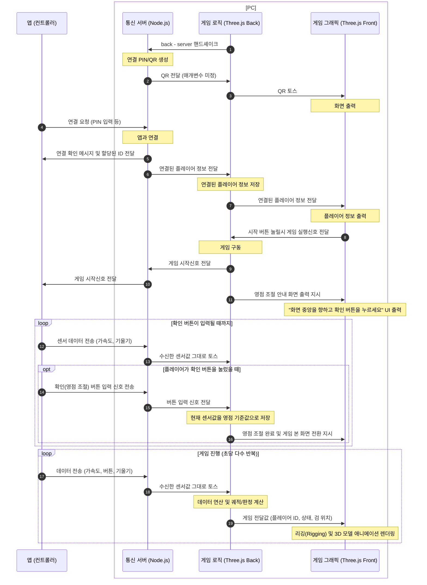

```mermaid
sequenceDiagram
    autonumber
    participant App as 앱 (컨트롤러)
    
    box transparent [PC]
    participant Server as 통신 서버 (Node.js)
    participant Back as 게임 로직 (Three.js Back)
    participant Front as 게임 그래픽 (Three.js Front)
    end

    %% 연결 단계
    Back->>Server: back - server 핸드셰이크
    Note over Server: 연결 PIN/QR 생성
    Server->>Back: QR 전달 (매개변수 미정)
    Back->>Front: QR 토스
    Note over Front: 화면 출력
    App->>Server: 연결 요청 (PIN 입력 등)
    Note over Server: 앱과 연결
    Server->>App: 연결 확인 메시지 및 할당된 ID 전달
    Server->>Back: 연결된 플레이어 정보 전달
    Note over Back: 연결된 플레이어 정보 저장
    Back->>Front: 연결된 플레이어 정보 전달
    Note over Front: 플레이어 정보 출력
    Front->>Back: 시작 버튼 눌릴시 게임 실행신호 전달
    Note over Back: 게임 구동
    Back->>Server: 게임 시작신호 전달
    Server->>App: 게임 시작신호 전달

    %% 게임 최초실행시 (영점 조절)
    Back->>Front: 영점 조절 안내 화면 출력 지시
    Note over Front: "화면 중앙을 향하고 확인 버튼을 누르세요" UI 출력
    loop 확인 버튼이 입력될 때까지
        App->>Server: 센서 데이터 전송 (가속도, 기울기)
        Server->>Back: 수신한 센서값 그대로 토스
        opt 플레이어가 확인 버튼을 눌렀을 때
            App->>Server: 확인(영점 조절) 버튼 입력 신호 전송
            Server->>Back: 버튼 입력 신호 전달
            Note over Back: 현재 센서값을 영점 기준값으로 저장
            Back->>Front: 영점 조절 완료 및 게임 본 화면 전환 지시
        end
    end

    %% 실시간 게임 루프
    loop 게임 진행 (초당 다수 반복)
        App->>Server: 데이터 전송 (가속도, 버튼, 기울기)
        Server->>Back: 수신한 센서값 그대로 토스
        Note over Back: 데이터 연산 및 궤적/판정 계산
        Back->>Front: 게임 전달값 (플레이어 ID, 상태, 검 위치)
        Note over Front: 리깅(Rigging) 및 3D 모델 애니메이션 렌더링
    end
```